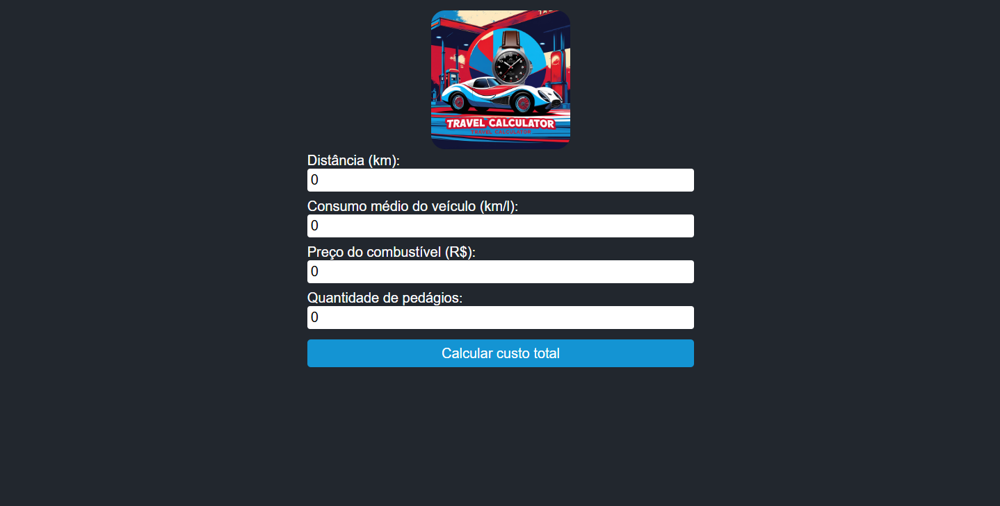

# 🚗 Calculadora de Custos de Viagem

A **Calculadora de Custos de Viagem** é uma aplicação React desenvolvida para calcular o custo total de uma viagem, considerando distância, consumo de combustível, preço do combustível e pedágios. O projeto foi criado como parte dos meus estudos em desenvolvimento web, utilizando React e TypeScript.

---

## 🎯 **Funcionalidades**
- 💰 Calcula o custo com combustível com base na distância e consumo médio do veículo.
- 🛣️ Calcula o custo com pedágios, considerando a quantidade e o valor de cada pedágio.
- ✅ Mostra o custo total da viagem de forma clara e organizada.
- 📱 Design responsivo e amigável para diferentes dispositivos.

---

## 🛠 **Tecnologias Utilizadas**
- **React**: Biblioteca JavaScript para criação de interfaces de usuário.
- **TypeScript**: Superset do JavaScript para tipagem estática.
- **CSS**: Para estilização e responsividade.
- **Vite**: Ferramenta de build rápida para desenvolvimento.

---

## 🖼 **Preview**



---

## 🚀 **Como Executar o Projeto**

### Pré-requisitos:
- [Node.js](https://nodejs.org/) instalado na máquina.
- Gerenciador de pacotes como [npm](https://www.npmjs.com/) ou [yarn](https://yarnpkg.com/).

### Passo a passo:
1. Clone o repositório:
   ```bash
   git clone https://github.com/thalissongoncalves/calculadora-de-custos-de-viagem

2. Acesse o diretório do projeto:
   ```bash
   cd calculadora-de-custos de viagem

3. Instale as dependências:
   ```bash
   npm install

4. Execute a aplicação:
   ```bash
   npm run dev

5. Abra o navegador no endereço:
   ```bash
   http://localhost:5173

📄 Licença
Este projeto está sob a licença MIT. Sinta-se à vontade para utilizá-lo e modificá-lo.
Consulte o arquivo LICENSE para mais informações.

💬 Feedback Ficou com alguma dúvida ou tem sugestões para melhorar este projeto? Entre em contato comigo ou abra uma issue no repositório. Toda contribuição é bem-vinda! 😊

📁 Estrutura do Projeto
   ```scss
   calculadora-de-viagem/
   ├── public/
   │   └── vite.svg (ícone)
   ├── src/
   │   ├── assets/ (imagens e recursos)
   │   ├── components/ (componentes reutilizáveis)
   │   ├── App.tsx (componente principal)
   │   ├── main.tsx (ponto de entrada do React)
   │   └── styles/ (arquivos de estilização)
   ├── index.html (estrutura HTML principal)
   ├── package.json (configuração do projeto)
   └── README.md (documentação do projeto)

